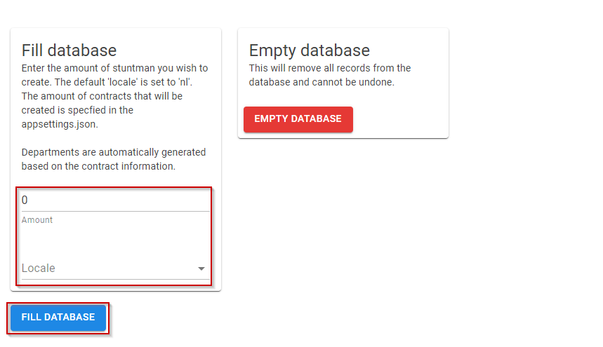

# Stuntman

> Because every app needs one

Stuntman is a blazor web application that you can use to create, well, stuntman.

Stuntman can be used as an HR source in HelloID as the dataset includes; _persons, contracts and departments_. The complete dataset is generated dynamically.

## Table of contents

- [Stuntman](#stuntman)
  - [Table of contents](#table-of-contents)
  - [What's in repo ?](#whats-in-repo-)
  - [Used nuget packages](#used-nuget-packages)
  - [Installation](#installation)
    - [Prerequisites](#prerequisites)
    - [Install the web application](#install-the-web-application)
  - [How to use](#how-to-use)
    - [UI](#ui)
    - [Database](#database)
    - [Create new data](#create-new-data)
    - [API](#api)

## What's in repo ?

- Stuntman blazor web application
  - API to manage stuntman, contracts and departments

## Used nuget packages

- EntityFrameworkCore.Sqlite
- EntityFrameworkCore.Tools
- Bogus
- FluentValidation
- MudBlazor
- SwashBuckle.AspNetCore.Swagger
- SwashBuckle.AspNetCore.SwaggerGen
- SwashBuckle.AspNetCore.SwaggerUI

## Installation

### Prerequisites

- [ ] .NET 6 is required to use the stuntman web application.

### Install the web application

To install the web application:

1. Download the latest release from: https://github.com/JeroenBL/Stuntman/releases
2. Unzip the contents of the zip file to a location of your choice.
3. Open a PowerShell or command prompt.
4. Change directory to the folder where the contents of the zip files are located.
5. On the console, type `dotnet ./stuntman.web.dll`
6. Browse to one of the URL's displayed in the console window.

> Tip  
> You can also specify the URL by adding the `--urls` switch. `dotnet ./stuntman.web.dll --urls "http://localhost:5004"`

## How to use

### UI

### Database

By default, an empty database `stuntman.db` will be included that is located in the root folder of the web application. You can move the database to a location of your liking. You will have to update the application settings to the new location. The

To view or update the database location:

1. Go to `Settings -> Application settings`.
2. Click on the `Edit` button to edit the application settings.

### Create new data

All data is generated dynamically. You will need to specify the amount of stuntman you wish to create. Based on the stuntman data set, the application will generate contract and departmental information.
Each stuntman will have at least __1__ contract with a maximum of __3__ contracts.

You can specify the maximum amount of contracts to create in the application settings. See `Settings -> Application settings -> MaxContracts`.

To generate new data:

1. Go to `Settings -> Manage database`.
2. Fill in the _amount_ of stuntman you wish to create.
3. Select a _locale_.
4. Click `Fill database` to generate the data.

### API

The following API endpoints are available:

| Method | Resource | Endpoint | Description |
| --- | --- | --- | --- |
| GET | /Stuntman | `/api/Stuntman` | Get all stuntmen |
| GET | /Stuntman | `/api/Stuntman/{id}` | Get a specific stuntman by ID |
| PATCH | /Stuntman | `/api/Stuntman/{id}` | Update a specific stuntman by ID |
| POST | /Stuntman | `/api/Stuntman` | Create a new stuntman |
| DELETE | /Stuntman | `/api/Stuntman/{id}` | Delete a specific stuntman by ID |
| GET | /Departments | `/api/Department` | Get all departments |
| GET | /Departments | `/api/Department/{id}` | Get a specific department by ID |
| PATCH | /Departments | `/api/Department/{id}` | Update a specific department by ID |
| POST | /Departments | `/api/Department` | Create a new department |
| DELETE | /Departments | `/api/Department/{id}` | Delete a specific department by ID |
| GET | /Contracts | `/api/Contract` | Get all contracts |
| GET | /Contracts | `/api/Contract/{id}` | Get a specific contract by ID |
| PATCH | /Contracts | `/api/Contract/{id}` | Update a specific contract by ID |
| POST | /Contracts | `/api/Contract` | Create a new contract |
| DELETE | /Contracts | `/api/Contract/{id}` | Delete a specific contract by ID |