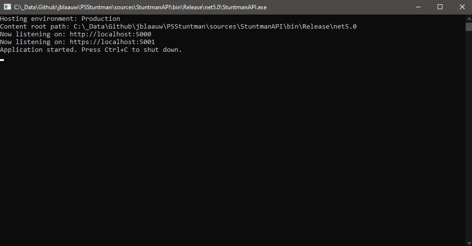

# Stuntman
## _because every app needs one_


__Stuntman__ can be used to create -well; stuntman_ who are always happy to test-drive your applications or HelloID connectors.  

> __Stuntman__ can be used as an _HR_ source in HelloID. The HelloID source connector can be found at: https://github.com/JeroenBL/HIDStuntman

## Used nuget packages

- https://github.com/bchavez/Bogus
- https://github.com/StackExchange/Dapper

## Table of contents

* [Prerequisites](#Prerequisites)
* [Installation](#Installation)
* [Using the Stuntman module](#Using-the-Stuntman-module)
* [Using the API](#Using-the-API)
* [Release history](#Release-history)
* [Contributing](#Contributing)

## Prerequisites

- [ ] Windows PowerShell 5.1 https://www.microsoft.com/en-us/download/details.aspx?id=54616
- [ ] .NET Framework 4.8 https://dotnet.microsoft.com/download/dotnet-framework/net48
- [ ] In order to use the mini API, .NET 5.0.x is required. https://dotnet.microsoft.com/download/dotnet/5.0

>  N.B. If you are using _Windows Server 2016 / Windows 10_ or higher, Windows PowerShell 5.1 is installed by default.

## Installation

1. Download the latest release. https://github.com/JeroenBL/Stuntman/releases
2. Copy the files to a sensible location
3. Import the module

```powershell
Import-Module "C:\Users\_YourUserName_\Documents\PSStuntman\PSStuntman.dll"
```

## Using the Stuntman module

The __Stuntman__ module contains the following cmdlets:

| _Cmdlet_                       | _Description_                                                |
| ------------------------------ | ------------------------------------------------------------ |
| New-StuntmanAndDepartments | Creates new stuntman and departments. Optionally saves the data to a database |
| Get-Stuntman                 | Retrieve a stuntman by <id> or all stuntman from the database |
| Get-Department   | Retrieve a department by <id> or all departments from the database |

---

## Cmdlet: New-StuntmanAndDepartments

Generates new stuntman and departments. The generated data can be saved to a database.

| _Parameter_        | _Description_                                                |
| ------------------ | ------------------------------------------------------------ |
| Amount           | The amount of stuntman you want to create, e.g. 10         |
| CompanyName      | The CompanyName. e.g. 'Contoso'. When left empty, a random CompanyName will be picked |
| DomainName       | The DomainName. e.g. 'contoso'. The default DomainName is set to 'enyoi' |
| DomainSuffix     | The DomainSuffix e.g. '.com'. The default suffix is set to '.local' |
| Locale           | The locale for the stuntman e.g. 'fr' (for French) or 'en' (for English). The default locale is set to 'nl'. To find more locales: https://github.com/bchavez/Bogus |
| SaveToDatabase     | Saves the generated Stuntman to a SQlite database. You will find the database in root folder from where this module is loaded |

> When the stuntman are generated, each will be randomly assigned to a department. In order to create departments, the generated stuntman are grouped by department. The first stuntman in the group will be selected and promoted to manager (the manager property will be set to '1'). Next, the department object is created with the desired value's.

| Departments                                                  | Company's                                                    |
| ------------------------------------------------------------ | ------------------------------------------------------------ |
| Engineering,<br/>            HR,<br/>            RD,<br/>            Support,<br/>            Legal,<br/>            Marketing,<br/>            Accounting,<br/>            Finance,<br/>            IT,<br/>            Staffing,<br/>            Sales,<br/>            Recruitment,<br/>            Management | Bluejam,<br/>            Buzzdog,<br/>            Topiczoom,<br/>            Realcube,<br/>            Yodoo,<br/>            Fivechat,<br/>            Katz,<br/>            Edgeify,<br/>            Skibox,<br/>            Yabadooda,<br/>            Kayveo,<br/>            Skilith,<br/>            Tavu,<br/>            Browsebug,<br/>            Kwimbee,<br/>            Eabox,<br/>            Quatz,<br/>            Realpoint,<br/>            Yata,<br/>            Flashspan,<br/>            Yadel,<br/>            Eare,<br/>            Divanoodle,<br/>            Jabbersphere,<br/>            Tagchat,<br/> |

---

### Example 1

```powershell
New-StuntmanAndDepartments -Amount 1 -CompanyName MyCoolCompany -DomainName ASP -DomainSuffix NET -Locale en
```

Creates a new stuntman with the provided parameter value's.

```powershell
Id                   : 924000
UserId               : 101
ExternalId           : DEMO101
GivenName            : Lila
FamilyName           : Streich
DisplayName          : Lila Streich
UserName             : L.Streich@ASP.NET
Initials             : L.S
PersonalEmailAddress : Lila.Streich84@hotmail.com
PersonalPhoneNumber  : 844.420.7169
BusinessEmailAddress : L.Streich@MyCoolCompany.com
BusinessPhoneNumber  : 1-850-778-2427
BirthDate            : 14-1-1954 03:55:29
BirthPlace           : Kelsiberg
Language             : en
City                 : Nikoshire
Street               : Freddy Square
HouseNumber          : 131
ZipCode              : 16943
IsActive             : 1
UserGuid             : a5a38b82-56d0-4018-b8fd-edd59f97575e
Title                : Central Interactions Supervisor
IsManager            : 0
StartDate            : 25-11-2016 02:42:37
EndDate              : 15-5-2021 01:05:27
HoursPerWeek         : 40
Company              : MyCoolCompany
Department           : HR
DepartmentExternalId : 3
CostCenter           : HR
ContractGuid         : 859bd885-3eb7-4acc-957a-07bf8054ec7f
```

## Cmdlet: Get-Stuntman

Retrieves the created stuntman from the database.

| _Parameter_ | _Description_                    |
| ----------- | -------------------------------- |
| Id          | Retrieve a single stuntman by Id |

### Example 1

```powershell
Get-Stuntman
```

Retrieves all stuntman from the database:

### Example 2

```powershell
Get-Stuntman -Id 924000
```

Retrieves a stuntman with id '924000' from the database

```powershell
Id                   : 924000
UserId               : 101
ExternalId           : STUNTMAN1
GivenName            : Lila
FamilyName           : Streich
DisplayName          : Lila Streich
UserName             : L.Streich@DemoDomainName.com
Initials             : L.S
PersonalEmailAddress : Lila.Streich84@hotmail.com
PersonalPhoneNumber  : 844.420.7169
BusinessEmailAddress : L.Streich@DemoCompany.com
BusinessPhoneNumber  : 1-850-778-2427
BirthDate            : 14-1-1954 03:55:29
BirthPlace           : Kelsiberg
Language             : en
City                 : Nikoshire
Street               : Freddy Square
HouseNumber          : 131
ZipCode              : 16943
IsActive             : 1
UserGuid             : a5a38b82-56d0-4018-b8fd-edd59f97575e
Title                : Central Interactions Supervisor
IsManager            : 0
StartDate            : 25-11-2016 02:42:37
EndDate              : 15-5-2021 01:05:27
HoursPerWeek         : 40
Company              : DemoCompany
Department           : Engineering
DepartmentExternalId : 2
CostCenter           : HR
ContractGuid         : 859bd885-3eb7-4acc-957a-07bf8054ec7f
```

If you want to edit or view the generated data, make sure to download 'DB Browser for Sqlite' https://sqlitebrowser.org/


## Cmdlet: Get-Department

Retrieves the departments from the database.

### Example 1

```powershell
Get-Department
```

Retrieves all departments from the database.

```powershell
Id ExternalId DisplayName ManagerExternalId
-- ---------- ----------- -----------------
01          2 Engineering STUNTMAN1
02          3 HR          STUNTMAN2
```

### Example 2

```powershell
Get-Department -Id 01
```

Retrieves a department with id '01' from the database

```powershell
Id ExternalId DisplayName ManagerExternalId
-- ---------- ----------- -----------------
01          2 Engineering STUNTMAN1
```

## Using the API

__Stuntman__ comes with a tiny API. You can use this API to make the Stuntman available for a wider audience or when giving some demo's / instructions. 

Note that the API uses .NET 5.0.x https://dotnet.microsoft.com/download/dotnet/5.0

### Endpoint overview

| Endpoint         | Description                                    |
| ---------------- | ---------------------------------------------- |
| /                | Root endpoint for the API                      |
| /stuntman        | Retrieves all the stuntman using a HTTP GET    |
| /stuntman/{id}   | Retrieve stuntman by id                        |
| /departments     | Retrieves all the departments using a HTTP GET |
| /department/{id} | Retrieve department by id                      |

### Usage

2. In the directory where the _Stuntman.DLL_ and _stuntman.db_ files are located, run the executable: _StuntmanAPI.exe_ This will fire-up a console application that hosts the API.
   

3. On the console, you'll find the URL where the API is located. Typically: <http://localhost:5000> and <https://localhost:5001>

4. To make a call to the API using PowerShell:

   ```powershell
   Invoke-RestMethod -Method GET -Uri https://localhost:5001/Stuntman
   ```

> If you want to change the URL's, type: __StuntmanAPI.exe --urls <http://yourUrl:portnumber>__

## Release history

### Version 1.0.1 (2021-09-12)

- Added API calls (/stuntman/{id}) and (/departments/{id})
- Changed sync methods to async
- Minor changes to method calls to accomodate CRUD

### Version 1.0.0 (2021-09-09)

- Initial release

## Contributing

Find a bug or have an idea! Open an issue or submit a pull request!

**Enjoy!**